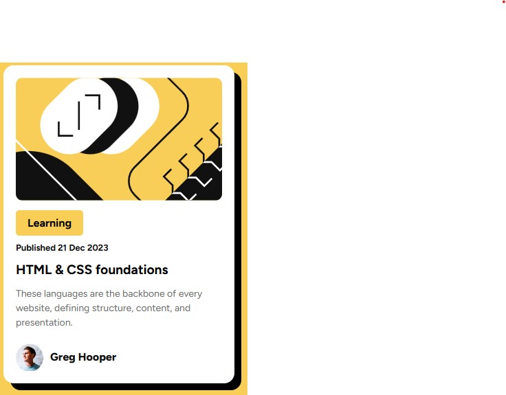

# Frontend Mentor - Blog preview card solution

This is a solution to the [Blog preview card challenge on Frontend Mentor](https://www.frontendmentor.io/challenges/blog-preview-card-ckPaj01IcS). Frontend Mentor challenges help you improve your coding skills by building realistic projects.

## Table of contents

- [Overview](#overview)
  - [The challenge](#the-challenge)
  - [Screenshot](#screenshot)
  - [Links](#links)
- [My process](#my-process)
  - [Built with](#built-with)
  - [What I learned](#what-i-learned)
  - [Continued development](#continued-development)
  - [Useful resources](#useful-resources)
- [Author](#author)
- [Acknowledgments](#acknowledgments)

## Overview

### The challenge

Users should be able to:

- See hover and focus states for all interactive elements on the page

### Screenshot

### Links

- Solution URL: [Add solution URL here](https://your-solution-url.com)
- Live Site URL: [Add live site URL here](https://your-live-site-url.com)

## My process

### Built with

- Semantic HTML5 markup
- CSS custom properties
- Flexbox

### What I learned

Now i can say that i learn basic HTML structure and syntax, CSS selectors, properties and values.
Responsive design techniques using media queries.
Flexbox layout.
CSS custom properties.
-How to use CSS Grid.
-How to use CSS variables.
-How to use CSS selectors.
-How to use CSS properties.
-How to use CSS values.

### Continued development

Use this section to outline areas that you want to continue focusing on in future projects. These could be concepts you're still not completely comfortable with or techniques you found useful that you want to refine and perfect.

### Useful resources

- [w3schools ](https://www.w3schools.com) - This helped me for finding out to remove the color of a link. I really liked this pattern and will use it going forward.

## Author

- Website - [Ajaya Rajbhandari](https://www.your-site.com)
- Frontend Mentor - [@Ajaya-Rajbhandari](https://www.frontendmentor.io/profile/Ajaya-Rajbhandari)

## Acknowledgments

BlackBox Ai help me to understand most of the css that were unknown to me. So thanks to the AI.
